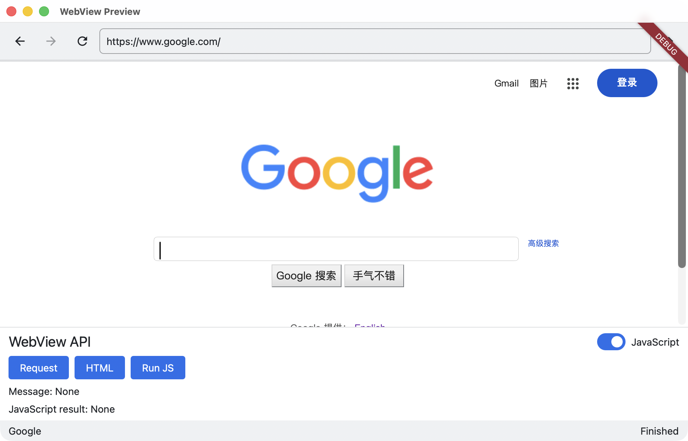
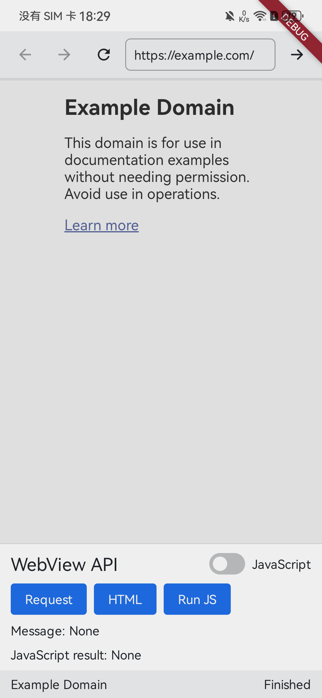
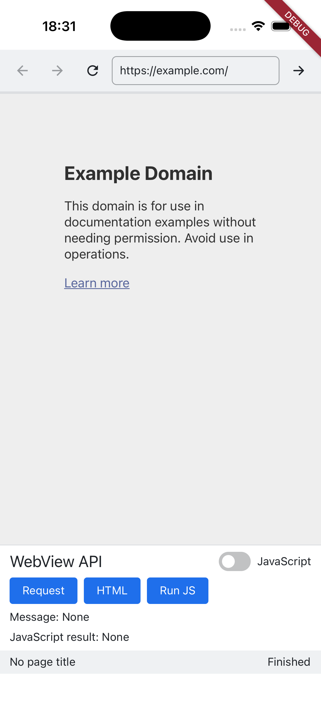

# HuxerUI WebView

HuxerUI WebView is a portable embedded web-content component for HuxerUI applications. It provides a common C++ API
for navigation, custom requests, HTML content, JavaScript evaluation, page-to-application messaging, and observable
browser state.

The library uses the platform web engine and integrates it as a HuxerUI `PlatformView`.

## Preview

<table>
  <thead>
    <tr>
      <th colspan="2">macOS</th>
    </tr>
  </thead>
  <tbody>
    <tr>
      <td colspan="2" align="center">
        
      </td>
    </tr>
    <tr>
      <th>Android</th>
      <th>iOS</th>
    </tr>
    <tr>
      <td align="center">
        
      </td>
      <td align="center">
        
      </td>
    </tr>
  </tbody>
</table>

## Features

- Declarative URL and JavaScript configuration
- Retained controller for browser commands
- Back, forward, reload, and stop operations
- URL, request, and inline HTML loading
- Navigation policy and lifecycle events
- Page title, progress, loading, and history state
- JavaScript evaluation with asynchronous results
- Text messages from page JavaScript through `huxerui.postMessage`

## Supported platforms

| Platform | Engine | Notes |
| --- | --- | --- |
| Android | Android WebView | Android API 23 or later |
| iOS | WKWebView | iOS 13 or later |
| macOS | WKWebView | WebKit is linked by the library |
| Windows | WebView2 | Requires the WebView2 SDK when building and the WebView2 Runtime when running |
| Web | iframe | Subject to browser embedding and cross-origin restrictions |

## Add the library

The library requires CMake 3.20 or later and a configured HuxerUI SDK.

Add the Git repository after the application's `huxerui_add_app` call:

```cmake
huxerui_use_library(my_app
        TARGET HuxerUI::WebView
        URL "https://github.com/HuxerUI/Lib-WebView.git"
        REVISION "<full-commit-sha>"
)
```

Replace `<full-commit-sha>` with the complete 40-character SHA of the revision to use. Include the public API with:

```cpp
#include <huxerui/webview.h>
```

On Windows, set `WEBVIEW2_SDK_ROOT` to the extracted Microsoft WebView2 NuGet package root before configuring the
project.

## Quick start

Install the platform adapter in the application root, retain a controller in composition, and keep navigation output
in application state:

```cpp
#include <huxerui/huxerui.h>
#include <huxerui/webview.h>

using namespace huxerui;

[[huxerui::composable]]
View WebContent() {
  auto requested_url = UseState(std::string("https://example.com"));
  auto navigation = UseState(WebViewNavigationState{
      .url = requested_url,
  });
  WebViewController controller = UseWebViewController();

  return Column {
    Row {
      Button("Back")
          .OnClick([controller] {
            controller.GoBack();
          })
          .With(Enabled(navigation->can_go_back)),
      Button("Forward")
          .OnClick([controller] {
            controller.GoForward();
          })
          .With(Enabled(navigation->can_go_forward)),
      Button("Reload").OnClick([controller] {
        controller.Reload();
      }),
      Button("Documentation").OnClick([controller] {
        controller.LoadUrl("https://github.com/HuxerUI/HuxerUI");
      }),
    }.With(Spacing(8.0F)),
    WebView({
          .url = requested_url,
          .java_script_enabled = false,
        }, controller)
        .On<WebViewEvents::NavigationChanged>(
            [requested_url, navigation](const WebViewNavigationState& state) {
              requested_url = state.url;
              navigation = state;
            }
        )
        .With(Grow(), Frame{.min_height = 320.0F}, ClipChildren()),
  }.With(Spacing(8.0F), CrossAlign(CrossAxisAlignment::Stretch));
}

View App() {
  return FlatTheme(WebContent());
}

const Application application{
    App,
    {
        .root_hooks = {
            huxerui::InstallWebView,
        },
    }
};
```

`WebView` is a `PlatformView` leaf and has no portable intrinsic size. Give it bounded geometry with `Grow`, `Frame`,
or another bounded parent layout.

## Navigation model

`WebViewProperties::url` is controlled application state. Changing it starts a top-level navigation when the value is
different from the current property value. Write `WebViewNavigationState::url` back to the same state when links,
redirects, or browser history should become the new controlled value.

Use `LoadUrl` as a convenient imperative GET entry point:

```cpp
controller.LoadUrl("https://example.com/account");
```

Use `LoadRequest` when a request needs a method, headers, or body:

```cpp
controller.LoadRequest({
    .url = "https://example.com/session",
    .method = "POST",
    .headers = {{"Content-Type", "application/json"}},
    .body = R"({"remember":true})",
});
```

Custom request capabilities depend on the platform engine. The Web target accepts only GET navigation without custom
headers or a body.

Load content directly with an optional base URL:

```cpp
controller.LoadHtml({
    .content = "<h1>Hello from HuxerUI</h1>",
    .base_url = "https://example.com/",
});
```

Controller commands return `false` when the controller is not connected or the active platform cannot accept the
operation. A `true` result means the command was accepted, not that navigation or evaluation completed.

## Events

Events are attached to the `WebView` declaration with `.On<Event>(handler)`.

| Event | Purpose |
| --- | --- |
| `WebViewEvents::NavigationRequested` | Synchronously allow or cancel a pending navigation |
| `WebViewEvents::NavigationChanged` | Receive the latest URL, title, loading, progress, and history snapshot |
| `WebViewEvents::LoadStarted` | Observe the start of a top-level load |
| `WebViewEvents::LoadFinished` | Observe successful completion |
| `WebViewEvents::LoadFailed` | Receive a platform diagnostic code, message, and optional URL |
| `WebViewEvents::MessageReceived` | Receive text posted by page JavaScript |

Return `false` from `NavigationRequested` to cancel a request. The decision is synchronous; do not start asynchronous
policy work from the handler.

```cpp
.On<WebViewEvents::NavigationRequested>([](const WebViewNavigationRequest& request) {
  return !request.is_main_frame || IsAllowedNavigation(request.url);
})
```

In this example, `IsAllowedNavigation` is an application-defined policy that validates the complete URL.

Browser-hosted cross-origin pages may expose approximate navigation state. Unavailable titles are empty and unavailable
history actions are `false`.

## JavaScript

JavaScript is disabled by default. Enable it in the complete property snapshot when the loaded content requires it:

```cpp
WebView({
    .url = requested_url,
    .java_script_enabled = true,
}, controller)
```

Evaluate a script through the controller and inspect the `PlatformResult` in the completion callback:

```cpp
controller.EvaluateJavaScript(
    "({title: document.title, url: location.href})",
    [](PlatformResult<std::string> result) {
      if (const auto* value = std::get_if<std::string>(&result)) {
        // Use the platform's JSON representation in *value.
      } else {
        const PlatformError& error = std::get<PlatformError>(result);
        // Report error.message to the application.
      }
    }
);
```

When JavaScript is enabled, a page can send text to the application:

```javascript
huxerui.postMessage("ready");
```

Receive it with:

```cpp
.On<WebViewEvents::MessageReceived>([](const std::string& message) {
  // Treat message as untrusted input.
})
```

## Security

- Treat every URL, JavaScript result, and page message as untrusted input.
- Restrict navigation to application-approved destinations when displaying external content.
- Enable JavaScript only for content that needs it.
- Do not place secrets in evaluated scripts or page messages.
- Expect CSP, `X-Frame-Options`, sandboxing, CORS, and other browser policies to affect the Web target.

The message bridge does not make page content trusted. Validate message formats and enforce application authorization
before performing privileged actions.

## Preview application

The preview under [`examples/preview`](examples/preview) provides a browser-style interface and demonstrates navigation,
custom requests, inline HTML, JavaScript evaluation, and page messages.

Build and run it with the HuxerUI CLI from the preview directory:

```sh
cd examples/preview
huxerui build macos --profile debug
huxerui run macos --profile debug
```

Replace `macos` with another supported platform configured on the host.

## API reference

The complete public contract and user-facing API comments are available in
[`include/huxerui/webview.h`](include/huxerui/webview.h).

## License

HuxerUI WebView is available under the [MIT License](LICENSE).
